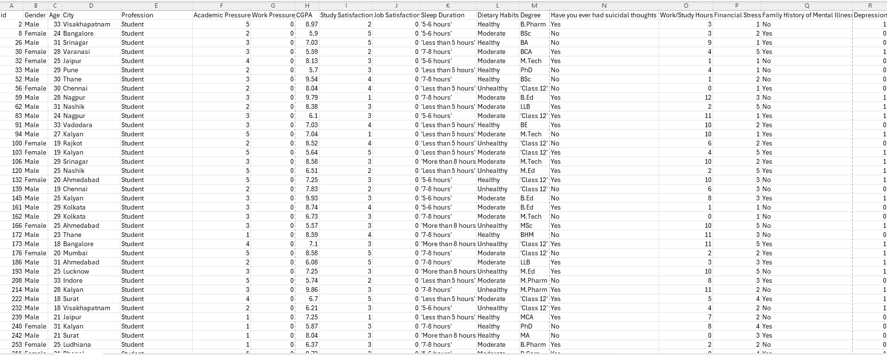
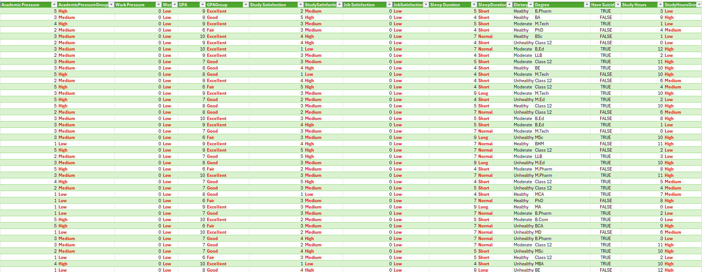
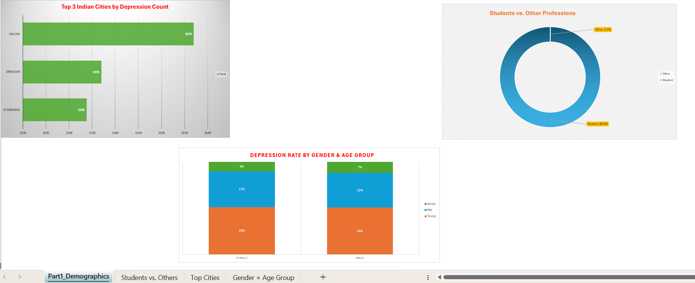
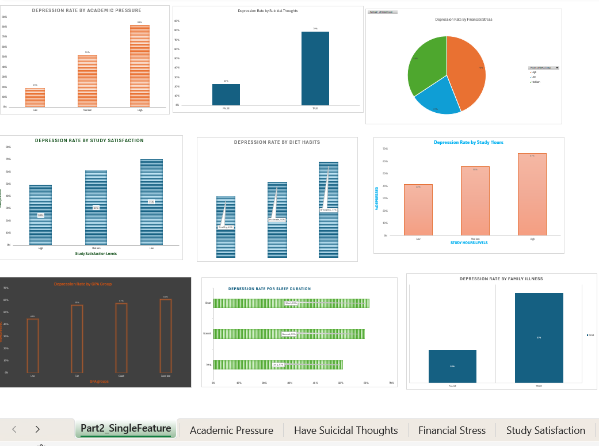
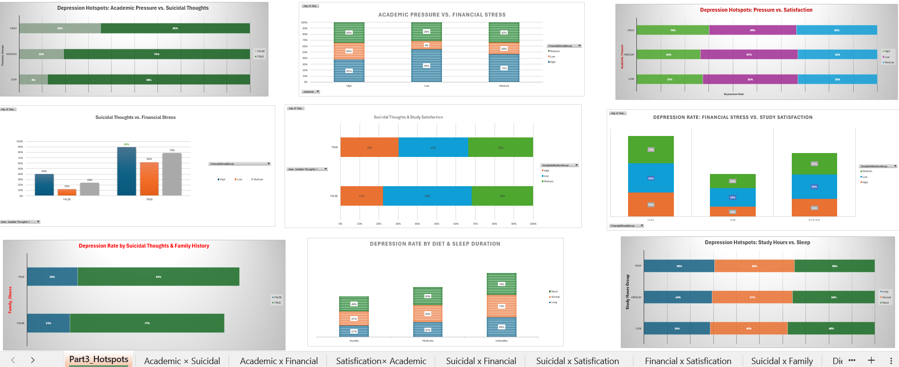

# 💡 Student Depression Analysis with Excel 📊 

**A data-driven project deep dive into the academic, lifestyle, and societal factors driving depression among students**, using Excel to uncover high-impact stressors and provide actionable recommendations.

---

## Table of Contents 📑

1. [About the Project](#about-the-project)  
2. [Introduction & Objectives 🎯](#introduction--objectives-)  
3. [Data Source & Context 🗂️](#data-source--context-️)  
4. [Data Cleaning & Transformation 🔄](#data-cleaning--transformation-)  
5. [Exploratory Data Analysis 🔍](#exploratory-data-analysis-)  
   - [Part 1: Demographic Analysis](#part-1-demographic-analysis)
   - [Part 2: Single Feature Analysis](#part-2-single-feature-analysis)
   - [Part 3: Hotspots Analysis](#part-3-hotspots-analysis)  
6. [Insights from Analysis 💡](#insights-from-analysis-)  
7. [Recommendations & Implementation 🎯](#recommendations--implementation-)
8. [Conclusion 📝](#conclusion-)
9. [What I Learned 💡](#what-i-learned-)
10. [Tools I Used 🛠️](#tools-i-used-️)  
11. [Next Steps ⏭️](#next-steps-️)  
12. [Contact 📬](#contact-)

---

## About the Project

This project analyzes a Kaggle survey (27,901 rows × 18 columns) conducted in India to identify the top predictors of student depression and propose data-driven solutions. We used Excel’s Power Query, PivotTables, and pivot charts to transform, analyze, and visualize the raw data.After ETL processing of the raw data, we performed three analytical phases and derived actionable insights.

---

## Introduction & Objectives 🎯

**Why this matters:**  
Student mental health is a critical global issue. Depression undermines well-being and academic success. By uncovering key stress factors, we aim to inform strategies that reduce depression rates.

**Objectives:**  
- 🔍 **Identify leading single and compound predictors of student depression.**  
- 💡 **Recommend strategies to reduce depression rates among students.**

---

## Data Source & Context 🗂️

**Resources:** 

👉 **[Project Videos](https://bit.ly/4jN6e2r) 🎞️**  
👉 **[Kaggle Dataset](https://www.kaggle.com/datasets/adilshamim8/student-depression-dataset)📊**  
👉 **[Excel Workbook](https://github.com/EngMoheb/Std_Dep/blob/main/STD_DEP_fnl.xlsx)**  

**Workbook Structure:**  
- **Raw Data**  
- **Cleaned Data**  
- **Part 1: Demographics Analysis**  
- **Part 2: Single-Feature Analysis**  
- **Part 3: Hotspots Analysis**  

---

## Data Cleaning & Transformation 🔄

1. **Deduplication:** Removed duplicate records.  
2. **Ordinal Buckets:** Created Low/Medium/High groups for pressure, stress, and satisfaction scales.  
3. **Parsing & Bucketing:** Converted “Sleep Duration” text to numeric hours and grouped into Short/Normal/Long.  
4. **Boolean Flags:** Mapped depression and suicidal-thought responses to TRUE/FALSE.  
5. **Enrichment:** Added `Country` and `IsStudent` flags for segmentation.

---

## Exploratory Data Analysis 🔍

### Part 1: Demographic Analysis  
  
- **Top Indian Cities by Depression Count:** Kalyan (1,570), Srinagar (1,370), Hyderabad (1,338).  
- **Student Status:** 99% of depressed respondents are students.  
- **Gender × Age Bands:**  
  - *Females* (44%): Young 23%, Mid 17%, Senior 4%.  
  - *Males* (56%): Young 28%, Mid 21%, Senior 7%.

#### Detailed Observations  
- **Regional Clusters:** Urban centers show elevated depression counts.  
- **Student Dominance:** Non-students report minimal depression, validating focus on student cohorts.  
- **Age Pattern:** Younger students are disproportionately affected, suggesting transitional stress in early academic years.

### Part 2: Single Feature Analysis   
  
- **High Academic Pressure:** 81.6% depressed  
- **Suicidal Thoughts = TRUE:** 79.1% depressed  
- **High Financial Stress:** 75.6% depressed  
- **Low Study Satisfaction:** 70.7% depressed  
- **Unhealthy Diet:** 70.7% depressed  
- **High Study Hours:** 66.7% depressed  
- **Excellent GPA:** 61.0% depressed  
- **Short Sleep Duration:** 61.3% depressed  
- **Family Illness History = TRUE:** 61.3% depressed

#### In-Depth Insights  
- Academic and emotional stressors (pressure, ideation) are top predictors, overshadowing lifestyle variables.  
- Diet and sleep emerge as modifiable behaviors—prime targets for wellness programs.

### Part 3: Hotspots Analysis  
  
- **High Academic Pressure + Suicidal Thoughts:** 91.9% depressed  
- **High Academic Pressure + High Financial Stress:** 90.7% depressed  
- **Suicidal Thoughts + High Financial Stress:** 89.1% depressed  
- **High Pressure + Low Satisfaction:** 89.0% depressed  
- **Suicidal Thoughts + Low Satisfaction:** 86.8% depressed  
- **High Financial Stress + Low Satisfaction:** 83.0% depressed  
- **Suicidal Thoughts + Family Illness:** 81.0% depressed  
- **Unhealthy Diet + Short Sleep:** 73.0% depressed  
- **High Study Hours + Short Sleep:** 69.0% depressed

---

## Insights from Analysis 💡

- **Peak Compound Risk:** *High Academic Pressure + Suicidal Thoughts* → **91.9%**.  
- **Top Single Predictors:** Academic Pressure (81.6%), Suicidal Ideation (79.1%), Financial Stress (75.6%).

---

## Recommendations & Implementation 🎯

1. **Reduce Academic Pressure**  
   - 📚 **Mindfulness & CBT Workshops:** Semester-long programs shown to lower stress by 30–40%.  
   - 👩🏫 **Growth-Mindset Training:** Integrate resilience and study-skill modules into curricula.  
2. **Support Suicidal Ideation**  
   - 🛡️ **Routine PHQ-9 Screening:** Deploy digital self-assessments with automated referrals for positive screens.  
   - 🤝 **safeTALK Training:** Certify faculty and peers to recognize warning signs and connect students to support.  
3. **Alleviate Financial Stress**  
   - 💳 **Financial Literacy Clinics:** Host monthly “Money Matters” sessions on budgeting, scholarships, and debt management.  
   - 🆘 **Emergency Micro-Grants:** Fast-track funding (48-hour turnaround) for urgent needs.  
4. **Improve Well‑Being**  
   - 🍎 **Nutrition Counseling:** Offer dietitian consults and healthy-meal programs on campus.  
   - 😴 **Sleep Hygiene Programs:** Provide workshops, trackers, and dedicated sleep spaces.

*Implementation:* Partner with campus counseling, secure funding, and track outcomes via follow-up surveys.

---

## Conclusion 📝

Our Excel-driven analysis showed that **academic pressure**, **suicidal thoughts**, and **financial stress** are the strongest predictors of student depression, while **compound stressors** can push rates above **90%**. We also identified protective factors—low pressure and healthy diets—that halve depression rates. Targeting these areas allows stakeholders to implement data-backed interventions for healthier, more resilient student communities. ✨

---

## What I Learned 💡

1. **Power of Simple Tools:** Excel’s Power Query and PivotTables can deliver deep insights without advanced coding.  
2. **Storytelling with Data:** Clear visuals and structured workflows make complex findings accessible to non-technical audiences.  
3. **Importance of Context:** Segmenting data reveals nuanced patterns—subgroup analyses uncover insights missed by aggregate views.  
4. **Iterative Exploration:** Multiple analytical passes (demographics → features → interactions) are essential for robust conclusions.  
5. **Lifelong Learning:** Thanks to mentors (Alex Freberg, Luke Barousse, Mynda Treacy, Mo Chen), I’ve seen that continuous learning powers better analysis. 🚀

---

## Tools I Used 🛠️

- **Microsoft Excel:** Power Query for ETL, PivotTables for analysis, and pivot charts for visualization.  
- **Git & GitHub:** Version control and project hosting.  
- **ChatGPT:** Drafted and refined narrative content.  
- **DeepSeek AI:** Defined key questions and selected depression factors.  
- **Perplexity:** Conducted rapid research and fact-checking.  
- **Sider.ai:** Explored multiple AI models for insights.

---

## Next Steps ⏭️

- **Scale to SQL:** Migrate data to a relational database for advanced querying and to overcome Excel’s row limits.  
- **Advanced BI Tools:** Develop interactive dashboards in Power BI or Tableau to visualize real-time depression risk across cohorts.

---

## Contact 📬

**Lead Analyst:** Eng_Ahmed_Moheb  
🔗 [LinkedIn](https://www.linkedin.com/in/ahmed-moheb-09b37135a/)  
🔗 [Medium](https://medium.com/@ahmedmoheb151)  

---

*Thank you for exploring Student Depression Analysis—let’s collaborate to foster healthier campus communities!*
